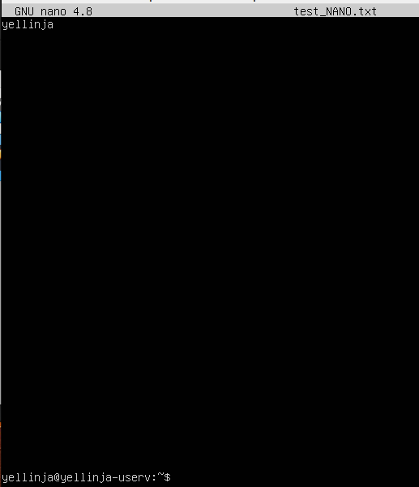
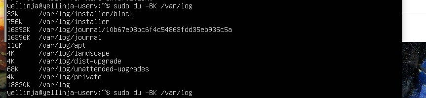

# Операционные системы UNIX/Linux (Базовый).

Установка и обновления системы Linux. Основы администрирования.

## ANSWERS

1. [DO1-LINUX](#do1-linux)

    1.1 [Установка ОС](#part-1-установка-ос)  
    1.2 [Создание пользователя](#part-2-создание-пользователя)  
    1.3 [Настройка сети ОС](#part-3-настройка-сети-ос)   
    1.4 [Обновление ОС](#part-4-обновление-ос)  
    1.5 [Использование команды  sudo](#part-5-использование-команды-sudo)  
    1.6 [Установка и настройка службы времени](#part-6-установка-и-настройка-службы-времени)  
    1.7 [Установка и использование текстовых редакторов](#part-7-установка-и-использование-текстовых-редакторов)  
    1.8 [Установка и базовая настройка сервиса SSHD](#part-8-установка-и-базовая-настройка-сервиса-sshd)   
    1.9 [Установка и использование утилит top, htop](#part-9-установка-и-использование-утилит-top-htop)   
    1.10 [Использование утилиты fdisk](#part-10-использование-утилиты-fdisk)   
    1.11 [Использование утилиты df](#part-11-использование-утилиты-df)    
    1.12 [Использование утилиты du](#part-12-использование-утилиты-du)    
    1.13 [Установка и использование утилиты ncdu](#part-13-установка-и-использование-утилиты-ncdu)    
    1.14 [Работа с системными журналами](#part-14-работа-с-системными-журналами)     
    1.15 [Использование планировщика заданий CRON](#part-15-использование-планировщика-заданий-cron)    

## DO1-LINUX

В качестве результата работы ты должен предоставить отчет по выполненным задачам. В каждой части задания указано, что необходимо поместить в отчёт после её выполнения. Это могут быть скриншоты, какие-то данные и т.д.
- В репозиторий, в папку src, должен быть загружен отчёт с расширением .md;
- В отчёте должны быть выделены все части задания, как заголовки 2-го уровня;
- В рамках одной части задания всё, что помещается в отчёт, должно быть оформлено в виде списка;
- Каждый скриншот в отчёте должен быть кратко подписан (что показано на скриншоте);

## Part 1. Установка ОС

**== Вывод команды `cat /etc/issue` ==**\

## Part 2. Создание пользователя
**== Вызов команды для создания пользователя `sudo useradd -g groupname admin` и установка пароля командой `passwd admin` ==**\

**== Вывод команды `cat /etc/passwd` ==**\

## Part 3. Настройка сети ОС

**== Название машины yellinja-1 задается командой `sudo hostnamectl set-hostname yellinja-1` ==**

 **== Установка временной зоны задается командой `sudo timedatectl set-timezone Europe/Moscow` ==**

**== Названия сетевых интерфейсов выводиться командой `ifconfig -a` ==**\
\

`lo (loopback device)` – виртуальный интерфейс, присутствующий по умолчанию в любом Linux. Он используется для отладки сетевых программ и запуска серверных приложений на локальной машине. С этим интерфейсом всегда связан адрес 127.0.0.1. У него есть dns-имя – localhost. Посмотреть привязку можно в файле /etc/hosts.

**== ip адрес от DHCP сервера выводиться командой `sudo dhclient -v enp0s3` ==**\
\
`DHCP - Dynamic Host Configuration Protocol` - протокол динамической настройки узла, позволяющий сетевым устройствам автоматически получать IP-адрес и другие параметры, необходимые для работы в сети.

**== Внешний ip адрес выводиться командой `wget -qO- eth0.me` ==**\
\

**== Внутренний ip адрес выводиться командой `hostname -I` ==**\
\

##### Задай статичные (заданные вручную, а не полученные от DHCP сервера) настройки ip, gw, dns (используй публичный DNS серверы, например 1.1.1.1 или 8.8.8.8). 

**== Задаем статичные IP, GW и DNS редактируя файл ` /etc/netplan/00-installer-config.yaml ` ==**

**== Пингуем удаленные хосты 1.1.1.1 ==**

**== Пингуем удаленные хосты  ya.ru ==**

## Part 4. Обновление ОС

**== Обновить системные пакеты до последней версии ==**\
Обновляем информацию об актуальных версиях доступных пакетов командой `sudo apt update`\

Обновления отсутствуют\

Обновляем системные пакеты командой `sudo apt upgrade`\

## Part 5. Использование команды **sudo**

**== Даем права доступа узеру из [Part 2](#part-2-создание-пользователя) командой `sudo usermod -aG sudo admin` и Меняем hostname ОС от имени пользователя admin `sudo hostnamectl set-hostname admin-1`==**

`sudo (англ. Substitute User and do, дословно «подменить пользователя и выполнить»)` — программа для системного администрирования UNIX-систем, позволяющая делегировать те или иные привилегированные ресурсы пользователям с ведением протокола работы. Основная идея — дать пользователям как можно меньше прав, при этом достаточных для решения поставленных задач. Программа поставляется для большинства UNIX и UNIX-подобных операционных систем.

## Part 6. Установка и настройка службы времени

**== Для настройки службы автоматической синхронизации времени используем команду `sudo timedatectl set-ntp 1` ==**

**==  Вывод  команды `timedatectl show` ==**

## Part 7. Установка и использование текстовых редакторов 

**== Создать файл в текстовом редакторе и записать туда никнейм ==**

Для VIM и vi:
1) в терминале вводим sudo vim test_VIM.txt или sudo vi test_VIM.txt
2) в редакоре нажимаем «i»(режим вставки)
3) Записываем свой никнейм, 
4) нажимаем «esc» и вводим команду «:wq» для сохранения и выхода
5) нажимаем «enter».

Для Nano:

1) в терминале вводим sudo nano test_NANO.txt
2) Записываем свой никнейм
3) нажимаем «ctrl + x» и соглашаемся на сохранение «y» 
4) нажимаем «enter» для выхода.

**== VIM ==**

**== NANO ==**

**== vi ==**

**== Отредактировать файлы, заменив никнейм на строку «21 School 21», закрой файл без сохранения изменений ==**

Для VIM и vi:
1) в терминале вводим sudo vim test_VIM.txt или sudo vi test_VIM.txt
2) в редакоре нажимаем «i»(режим вставки)
3) Записываем 21 School 21, 
4) нажимаем «esc» и вводим команду «:q!» для выхода
5) нажимаем «enter».

Для Nano:
1) в терминале вводим sudo nano test_NANO.txt
2) Записываем  21 School 21
3) нажимаем «ctrl + x» и НЕ соглашаемся на сохранение «n» 
4) нажимаем «enter» для выхода.

**== VIM ==**

**== NANO ==**

**== vi ==**

**== Поиск никнейма на строку «21 School 21»  ==**

Для VIM и vi:
1) в терминале вводим sudo vim test_VIM.txt или sudo vi test_VIM.txt
2) в редакоре нажимаем «/»(режим поиска)
3) после пишем что хотим найти 
4) нажимаем «esc» и вводим команду «:q!» для выхода
5) нажимаем «enter».

Для Nano:
1) в терминале вводим sudo nano test_NANO.txt
2) нажимаем «ctrl + w» после пишем что хотим найти и  нажимаем «enter»
3) нажимаем «ctrl + x» и НЕ соглашаемся на сохранение «n» 
4) нажимаем «enter» для выхода.

**== VIM ==**

**== NANO ==**

**== vi ==**

**== Поиск и замена никнейма на строку «21 School 21»  ==**

Для VIM и vi:
1) в терминале вводим sudo vim test_VIM.txt или sudo vi test_VIM.txt
2) в редакоре набираем «:s/[подстрока которую заменяем]/[подстрока на которую заменяем]»
3) нажимаем «esc» и вводим команду «:wq» для выхода и сохранения
4) нажимаем «enter».

Для Nano:
1) в терминале вводим sudo nano test_NANO.txt
2) нажимаем «ctrl + w» и «ctrl + r»
3) пишем подстроку которую хотим заменить и  нажимаем «enter»
3) пишем подстроку на которую хотим заменить и нажимаем «enter»
4) нажимаем «ctrl + x» и соглашаемся на сохранение «y» 
5) нажимаем «enter» для выхода.

**== VIM ==**

**== NANO ==**

**== vi ==**

## Part 8. Установка и базовая настройка сервиса **SSHD**

`-` Удобно иметь доступ от одного компьютера к другому по сети, правда? Но чтобы это было не только удобно, но и безопасно, стоит использовать сервис SSH.

**== Устанавливаем службу SSHd при помощи командыы `sudo apt install openssh-server` ==**

**== Активируем автозагрузку службы при запуске системы командой `sudo upate-rc.d ssh defaults` ==**

**== Активируем службу командой `systemctl enable ssh` ==**

**== Включаем службу командой `systemctl start ssh` ==**

**== Вручную меняем порт на 2022 в файле `/etc/ssh/sshd_config` ==**

**== Используя команду ps, показываем наличие процесса sshd. ==**

`-F -` выдает подробную информацию по процессам\
`-С -` выдает информацию по дочерним процессам

**==Для перезапуска службу используем команду `sudo systemctl restart sshd.service` ==**

**==Вывод команды `netstat -tan` ==**

`-t -` - вывод TCP соединений; \
`-a -` - вывод прослушиваемых и непрослушиваемых сокетов; \
`-n -` - вывод в цифрах адреса, порта и имени пользователей.

`колонка Proto - ` выводит протоколы, используемые сокетом; \
`колонка Recv-Q -` выводит нескопированные пользовательской программой байты из сокета;\
`колонка Send-Q -` выводит не подтвержденные сокетом байты\
`колонка Local Address -` выводит адрес и номер порта локального сокета;\
`колонка Foreign Address -` выводит адрес и номер порта удаленного сокета;\
`колонка State -` выводит состояние сокета;\
`0.0.0.0 -` означает неопределенный адрес (любой).

## Part 9. Установка и использование утилит **top**, **htop**

**== Запусти утилиту `top` ==**

- По выводу команды `top` имеем:
  - `uptime` - 1 час и 2 мин.
  - `количество авторизованных пользователей` - 1
  - `общую загрузку системы` - 0.00, 0.00, 0.00
  - `общее количество процессов` - 97
  - `загрузку cpu` - 0.3%
  - `загрузку памяти` - 0.1 %
  - `pid процесса занимающего больше всего памяти` - 1
  - `pid процесса, занимающего больше всего процессорного времени` - 1
  
  **== Запусти утилиту `htop` отсортированному по PID ==**

  **== Запусти утилиту `htop` отсортированному по PERCENT_CPU ==**
  

  **== Запусти утилиту `htop` отсортированному по PERCENT_MEM ==**

  **== Запусти утилиту `htop` отсортированному по TIME ==**

  **== Запусти утилиту `htop` отфильтрованному для процесса sshd ==**

  **== Запусти утилиту `htop` с процессом syslog, найденным, используя поиск ==**

  **== Запусти утилиту `htop` с добавленным выводом hostname, clock и uptime ==**

 

## Part 10. Использование утилиты **fdisk**

**== Запуск команду fdisk -l ==**

 `название жесткого диска` - dev/sda
 `размер жесткого диска` - 30GiB
 `количество секторов` - 62914560
 `размер swap` - 2GiB

## Part 11. Использование утилиты **df** 

**== Запусk команды df ==**

`размер раздела` - 14339080\
`размер занятого пространства` - 5528908\
`размер свободного пространства` - 8059992\
`процент использования` - 41%\
`Eдиницу измерения в выводе` - байты

**== Запусk команды df -Th==**

`размер раздела` - 14G\
`размер занятого пространства` - 5.3G\
`размер свободного пространства` - 7.7G\
`процент использования` - 41%\
`Тип файловой системы для раздела` - ext4

## Part 12. Использование утилиты **du**

**== Запусk команду du ==**

**== Вывод размер папок /home командой `du -BK /home` ==**

**== Вывод размер папок /var командой `du -BK /var` ==**

**== Вывод размер папок /var/log командой `du -BK /var/log` ==**

**== Вывод размер всего содержимого /var/lib командой `du -BKa /var/lib` ==**

## Part 13. Установка и использование утилиты **ncdu**

**== Установи утилиту ncdu ==**

**== Вывод размер папок /home командой `ncdu  /home` ==**

**== Вывод размер папок /var командой `ncdu  /var` ==**

**== Вывод размер папок /var/log командой `ncdu  /var/log` ==**

## Part 14. Работа с системными журналами

**==  Время последней авторизации, имя пользователя и метод входа в систему по порядку на скриншоте в 1 строке. 2 строка успех авторизации==**

**==  Перезапусти службу SSHd командой `sudo systemctl restart sshd.service`. Скрин с сообщением о рестарте службы (4 строчка снизу) ==**

## Part 15. Использование планировщика заданий **CRON**

**== Запуск команды uptime через каждые 2 минуты ==**

Открываем на редакритование CRON командое `crontab -e` и прописываем `*/2 * * * * uptime` в него для срабатывания uptime через каждые 2 минуты.

**== Отображение в системном журнале работы cron и uptime ==**

**== Удали все задания из планировщика заданий (crontab -e и удаляем) просмотр текущего crontab -l==**

