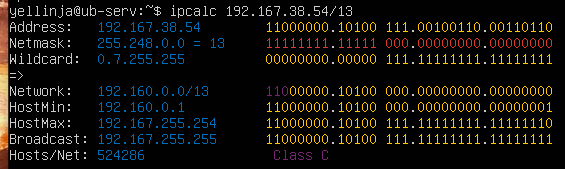
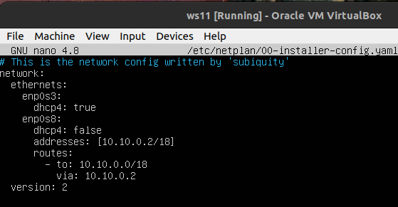
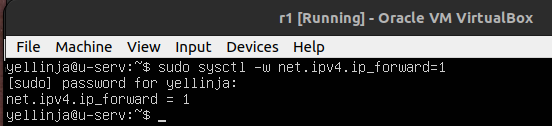
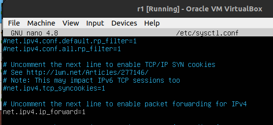

# Сети в Linux

Настройка сетей в Linux на виртуальных машинах.

## Contents

1. [Chapter I](#chapter-i)\
   1.1. [Инструмент ipcalc](#part-1-инструмент-ipcalc) \
   1.2. [Статическая маршрутизация между двумя машинами](#part-2-статическая-маршрутизация-между-двумя-машинами) \
   1.3. [Утилита iperf3](#part-3-утилита-iperf3) \
   1.4. [Сетевой экран](#part-4-сетевой-экран) \
   1.5. [Статическая маршрутизация сети](#part-5-статическая-маршрутизация-сети) \
   1.6. [Динамическая настройка IP с помощью DHCP](#part-6-динамическая-настройка-ip-с-помощью-dhcp) \
   1.7. [NAT](#part-7-nat) \
   1.8. [Допополнительно. Знакомство с SSH Tunnels](#part-8-дополнительно-знакомство-с-ssh-tunnels)
4. [Chapter IV](#chapter-iv)

## Chapter I

В качестве результата работы ты должен представить отчет по выполненным задачам. В каждой части задания указано, что должно быть помещено в отчёт после её выполнения. Это могут быть ответы на вопросы, скриншоты и т.д.
- В репозиторий, в папку src, должен быть загружен отчёт с расширением .md.
- В отчёте должны быть выделены все части задания, как заголовки 2-го уровня.
- В рамках одной части задания всё, что помещается в отчёт, должно быть оформлено в виде списка.
- Каждый скриншот в отчёте должен быть кратко подписан (что показано на скриншоте).
- Все скриншоты обрезаны так, чтобы была видна только нужная часть экрана.
- На одном скриншоте допускается отображение сразу нескольких пунктов задания, но они все должны быть описаны в подписи к скриншоту.
- На все виртуальные машины, созданные в процессе выполнения задания, устанавливай **Ubuntu 20.04 Server LTS**.

Список утилит: `ipcalc`, `ip`, `netplan`, `netstat`, `iperf3`, `iptables`, `ping`, `nmap`, `sysctl`, `tcpdump`, `traceroute`, `systemctl`, `telnet`, `dhclient`.

## Part 1. Инструмент **ipcalc**

##### Подними виртуальную машину (далее -- ws1)

#### 1.1. Сети и маски

##### 1) Адрес сети *192.167.38.54/13* ----> 192.160.0.0 (Network)

##### 2) Перевод маски *255.255.255.0* в префиксную и двоичную запись

Префиксная - /24 \
Двоичная - 11111111.11111111.11111111.00000000

##### */15* в обычную и двоичную
\
Обычная - 255.254.0.0 \
Двоичная - 11111111.1111111 0.00000000.00000000\

##### *11111111.11111111.11111111.11110000* в обычную и префиксную
\
Обычная - 255.255.255.240 \
Префиксная - /28

##### 3) Минимальный и максимальный хост в сети *12.167.38.4* 

При маске */8*:
\
Минимальный хост - 12.0.0.1
Максимальный хост - 12.255.255.254

При маске *11111111.11111111.00000000.00000000*:
\

Минимальный хост - 12.167.0.1
Максимальный хост -  12.167.255.254

При маске *255.255.254.0*:
\
Минимальный хост - 12.167.38.1
Максимальный хост - 12.167.39.254

При маске  */4*:
\
Минимальный хост - 0.0.0.1
Максимальный хост - 15.255.255.254

#### 1.2. localhost
##### Определи и запиши в отчёт, можно ли обратиться к приложению, работающему на localhost, со следующими IP: *194.34.23.100*, *127.0.0.2*, *127.1.0.1*, *128.0.0.1*
localhost (так называемый, «местный» от англ. local, или «локальный хост», по смыслу — этот компьютер) — в компьютерных сетях, стандартное, официально зарезервированное доменное имя для частных IP-адресов (в диапазоне 127.0.0.1 — 127.255.255.254 , RFC 2606) и соотвественно:\
*194.34.23.100* - нельзя т.к. выходит за диапазон\
*127.0.0.2* - можно т.к. в диапазоне\
*127.1.0.1* - можно т.к. в диапазоне\
*128.0.0.1* - можно т.к. выходит за диапазон

#### 1.3. Диапазоны и сегменты сетей
Диапазон частных сетей:
- *10.0.0.0* — *10.255.255.255* (*10.0.0.0/8*);
- *172.16.0.0* — *172.31.255.255* (*172.16.0.0/12*);
- *192.168.0.0* — *192.168.255.255* (*192.168.0.0/16*);
- *127.0.0.0* — *127.255.255.255* (зарезервировано для петлевых интерфейсов (не используется для обмена между узлами сети), т. н. localhost).

##### 1) Какие из перечисленных IP можно использовать в качестве публичного, а какие только в качестве частных:
*10.0.0.45* -  частные\
*134.43.0.2* - публичные\
*192.168.4.2* - частные\
*172.20.250.4* - частные\
*172.0.2.1* - публичные\
*192.172.0.1* -публичные \
*172.68.0.2* - публичные\
*172.16.255.255* - частные\
*10.10.10.10* - частные\
*192.169.168.1* - публичные

##### 2) Какие из перечисленных IP адресов шлюза возможны у сети *10.10.0.0/18*: 
\
*10.0.0.1* - не входит в диапазон между HostMin и HostMax\
*10.10.0.2* -  входит в диапазон между HostMin и HostMax\
*10.10.10.10* - входит в диапазон между HostMin и HostMax\
*10.10.100.1* - не входит в диапазон между HostMin и HostMax\
*10.10.1.255* - входит в диапазон между HostMin и HostMax\

## Part 2. Статическая маршрутизация между двумя машинами

`-` Теперь разберёмся, как связать две машины, используя статическую маршрутизацию.

**== Задание ==**

##### Подними две виртуальные машины (далее -- ws1 и ws2).

##### С помощью команды `ip a` посмотри существующие сетевые интерфейсы.

- В отчёт помести скрин с вызовом и выводом использованной команды.
##### Вызов `ip a` на VM ws1 и ws2

##### Опиши сетевой интерфейс, соответствующий внутренней сети, на обеих машинах и задать следующие адреса и маски и выполнил команду `netplan apply` для перезапуска сервиса сети.
ws1 - *192.168.100.10*, маска */16*\

ws2- *172.24.116.8*, маска */12*.

#### 2.1. Добавление статического маршрута вручную
##### Добавь статический маршрут от одной машины до другой и обратно при помощи команды вида `ip r add`.
##### Пропингуй соединение между машинами.
ws1 - слева; ws2 - справа

#### 2.2. Добавление статического маршрута с сохранением
##### Перезапусти машины.
##### Добавь статический маршрут от одной машины до другой с помощью файла */etc/netplan/00-installer-config.yaml*.

ws1\

ws2\

##### Пропингуй соединение между машинами.

## Part 3. Утилита **iperf3**

### 3.1. Перевести Mbps в MB/s следующие значения: 

#### 8 Mbps в MB/s - (8 Mbps = 1 MB/s)
#### 100 MB/s в Kbps - (100 MB/s - 819200 Kbps)
#### 1 Gbps в Mbps - (1 Gbps = 1024 Mbps)

`Kbps - Килобит/сек`\
`Mbps - Мегабит/сек`\
`Gbps Гигабит/сек`

### 3.2. Измерь скорость соединения между ws1 и ws2 c помощью утилиты **iperf3**

## Part 4. Сетевой экран

#### 4.1. Утилита **iptables**
##### Создай файл */etc/firewall.sh*, имитирующий фаерволл, на ws1:

##### Создай файл */etc/firewall.sh*, имитирующий фаерволл, на ws2:

##### Запусти файлы на обеих машинах командами `chmod +x /etc/firewall.sh` и `/etc/firewall.sh`.

chmod +x /etc/firewall.sh на ws1:\

chmod +x /etc/firewall.sh на ws2:\

bash /etc/firewall.sh и запуск на ws1:\

bash /etc/firewall.sh и запуск на ws2:\

Основное различие между этими двумя стратегиями заключается в подходе к безопасности. Подход «запрет по умолчанию» обычно считается более безопасным, поскольку он гарантирует, что через брандмауэр будет разрешен только явно разрешенный трафик. Однако им может быть сложнее управлять, поскольку каждый разрешенный трафик должен быть явно настроен. Подход «разрешение по умолчанию», хотя и проще в управлении, может быть менее безопасным, поскольку он разрешает весь трафик по умолчанию, а определенный трафик должен быть явно запрещен.

#### 4.2. Утилита **nmap**
##### Не пингуется  ws2:

##### nmap на ws2 - Хост поднят:

## Part 5. Статическая маршрутизация сети

##### Подними пять виртуальных машин (3 рабочие станции (ws11, ws21, ws22) и 2 роутера (r1, r2)).

#### 5.1. Настройка адресов машин
##### Настрой конфигурации машин в *etc/netplan/00-installer-config.yaml* согласно сети на рисунке.

##### Настрой конфигурации ws11

##### Настрой конфигурации ws21

##### Настрой конфигурации ws22

##### Настрой конфигурации r1

##### Настрой конфигурации r2

##### `ip -4 a` на ws11:

##### `ip -4 a` на ws21:

##### `ip -4 a` на ws22:

##### `ip -4 a` на r1:

##### `ip -4 a` на r2:

##### `ip -4 a` на r2:

##### Пингуем на ws22 c w21:

##### Пингуем на r1 c w11:

#### 5.2. Включение переадресации IP-адресов
##### Для включения переадресации IP, выполни команду `sysctl -w net.ipv4.ip_forward=1` на роутерах r1 и r2:

 Hа r1:\

 Hа r2:\

##### Открой файл */etc/sysctl.conf* и добавь в него следующую строку: `net.ipv4.ip_forward = 1`

 Hа r1:\

 Hа r2:\

#### 5.3. Установка маршрута по-умолчанию

##### Настрой маршрут по-умолчанию (шлюз) для рабочих станций. 

##### маршрут по-умолчанию  на ws11:

##### маршрут по-умолчанию  на ws21:

##### маршрут по-умолчанию  на ws22:

##### Вызови `ip r` и покажи, что добавился маршрут в таблицу маршрутизации.

##### `ip r` на ws11:

##### `ip r`  на ws21:

##### `ip r`  на ws22:

##### Пропингуй с ws11 роутер r2 и покажи на r2, что пинг доходит. Для этого используй команду: `tcpdump -tn -i eth0`

#### 5.4. Добавление статических маршрутов
##### Добавь в роутеры r1 и r2 статические маршруты в файле конфигураций. 

#### Hа r1:

#### Hа r2:\

##### `ip r` на r1:

##### `ip r`  на r2:

##### Запусти команды на ws11: `ip r list 10.10.0.0/[маска сети]` и `ip r list 0.0.0.0/0`

Причина, по которой для 10.10.0.0/[netmask] был выбран другой маршрут, отличный от маршрута по умолчанию (0.0.0.0/0), заключается в том, что таблица маршрутизации на ws11 имеет более конкретный маршрут для подсети 10.10.0.0/18, чем маршрут по умолчанию.

Когда пакет отправляется на IP-адрес назначения, таблица маршрутизации проверяется, чтобы определить наилучший путь для этого пакета. Таблица маршрутизации содержит несколько записей, каждая из которых указывает сеть или хост и соответствующий следующий переход для достижения этой сети или хоста.

В этом случае таблица маршрутизации на ws11 имеет запись для подсети 10.10.0.0/18 с более конкретной маской сети, чем маршрут по умолчанию. В результате, когда пакет направляется в подсеть 10.10.0.0/18, более конкретный маршрут выбирается вместо маршрута по умолчанию, поскольку он обеспечивает более прямой путь к сети назначения.

Обычно рекомендуется иметь в таблице маршрутизации больше конкретных маршрутов, поскольку они обеспечивают более эффективный путь к сети назначения и сокращают количество переходов, необходимых для достижения ее.

#### 5.5. Построение списка маршрутизаторов

##### При помощи утилиты **traceroute** построй список маршрутизаторов на пути от ws11 до ws21.
- 

##### Запусти на r1 команду дампа при вызове на ws11 traceroute: `tcpdump -tnv -i eth0`
- 

Traceroute работает, отправляя пакеты с увеличивающимися значениями TTL (время жизни) к месту назначения. TTL ограничивает количество маршрутизаторов или переходов, через которые пакет может пройти, прежде чем он будет отброшен. Каждый маршрутизатор на пути уменьшает значение TTL пакета на единицу. Когда значение TTL пакета достигает нуля, маршрутизатор, который обработал пакет, отбрасывает его и отправляет сообщение ICMP «время превышено» обратно источнику.

Traceroute отправляет серию пакетов с увеличивающимися значениями TTL, и каждый маршрутизатор на пути отправляет обратно сообщение ICMP «время превышено» со своим IP-адресом. Затем Traceroute отображает IP-адреса маршрутизаторов в том порядке, в котором они были обнаружены, что дает представление о пути, пройденном пакетами для достижения места назначения.

#### 5.6. Использование протокола **ICMP** при маршрутизации

##### Пропингуй с ws11 несуществующий IP (например, *10.30.0.111*) с помощью команды: `ping -c 1 10.30.0.111`

##### Запусти на r1 перехват сетевого трафика, проходящего через eth0 с помощью команды: `tcpdump -n -i eth0 icmp`

## Part 6. Динамическая настройка IP с помощью **DHCP**

##### Для r2 настрой в файле */etc/dhcp/dhcpd.conf* конфигурацию службы **DHCP**:

##### 1) Укажи адрес маршрутизатора по-умолчанию, DNS-сервер и адрес внутренней сети. Файл для r2:

##### 2) В файле *resolv.conf* пропиши `nameserver 8.8.8.8`.

##### Перезагрузи службу **DHCP** командой `systemctl restart isc-dhcp-server`. 

##### Машине ws21 выставляем настройки на получения динамического адреса и делаем `reboot` вм. 

#### Через `ip a` покажи, что она получила адрес. 

#### Также пропингуй ws22 с ws21.

##### Укажи MAC адрес у ws11, для этого в *etc/netplan/00-installer-config.yaml* надо добавить строки: `macaddress: 10:10:10:10:10:BA`, `dhcp4: true`.

##### MAC адрес у ws11 в настройках вм.

##### Для r1 настрой аналогично r2, но сделай выдачу адресов с жесткой привязкой к MAC-адресу (ws11). 
##### 1) DNS-сервер и адрес внутренней сети. Файл для r1:

##### 2) В файле *resolv.conf* пропиши `nameserver 8.8.8.8` на r1.

#### Также пропинговали r1 с ws11.

##### Запроси с ws21 обновление ip адреса.
Исспоьзуя команды hostmane -I просматриваем ip
и обновляем sudo dhclient enp0s8.\
\

 Команда sudo dhclient enp0s3 задает новый адрес указанному интерфейсу.

## Part 7. **NAT**

##### В файле */etc/apache2/ports.conf* на ws22 и r1 измени строку `Listen 80` на `Listen 0.0.0.0:80`, то есть сделай сервер Apache2 общедоступным.

##### Запусти веб-сервер Apache командой `service apache2 start` на ws22 и r1.

##### Добавь в фаервол, созданный по аналогии с фаерволом из Части 4, на r2 следующие правила:
1) Удаление правил в таблице filter - `iptables -F`;\
2) Удаление правил в таблице "NAT" - `iptables -F -t nat`;\
3) Отбрасывать все маршрутизируемые пакеты - `iptables --policy FORWARD DROP`.\

##### Запускаем файл также, как в Части 4.

##### Проверь соединение между ws22 и r1 командой `ping`.

##### Добавь в файл ещё одно правило: 4) Разрешить маршрутизацию всех пакетов протокола **ICMP**.

##### Запускаем файл также, как в Части 4.

##### Проверь соединение между ws22 и r1 командой `ping`.

##### Добавь в файл ещё два правила:
5) Включи **SNAT**, а именно маскирование всех локальных ip из локальной сети, находящейся за r2 (по обозначениям из Части 5 - сеть 10.20.0.0).
6) Включи **DNAT** на 8080 порт машины r2 и добавить к веб-серверу Apache, запущенному на ws22, доступ извне сети.\

##### Запускаем файл также, как в Части 4.

##### Проверь соединение по TCP для **SNAT**: для этого с ws22 подключиться к серверу Apache на r1 командой:`telnet [адрес] [порт]`

##### Проверь соединение по TCP для **DNAT**: для этого с r1 подключиться к серверу Apache на ws22 командой `telnet` (обращаться по адресу r2 и порту 8080).

## Part 8. Дополнительно. Знакомство с **SSH Tunnels**

##### Запусти на r2 фаервол с правилами из Части 7.

##### Запусти веб-сервер **Apache** на ws22 только на localhost (то есть в файле */etc/apache2/ports.conf* измени строку `Listen 80` на `Listen localhost:80`).

Файл */etc/apache2/ports.conf*\

Запуск веб-сервера\

##### Воспользуйся *Local TCP forwarding* с ws21 до ws22, чтобы получить доступ к веб-серверу на ws22 с ws21.

##### Воспользуйся *Remote TCP forwarding* c ws11 до ws22, чтобы получить доступ к веб-серверу на ws22 с ws11.

##### Для проверки, сработало ли подключение в обоих предыдущих пунктах, перейди во второй терминал (например, клавишами Alt + F2) и выполни команду:
`telnet 127.0.0.1 [локальный порт]`

