# Basic CI/CD

Разработка простого **CI/CD** для проекта *SimpleBashUtils*. Сборка, тестирование, развертывание.

## Contents

1. [Chapter I](#chapter-i) \
   1.1. [Настройка gitlab-runner](#part-1-настройка-gitlab-runner)  
   1.2. [Сборка](#part-2-сборка)  
   1.3. [Тест кодстайла](#part-3-тест-кодстайла)   
   1.4. [Интеграционные тесты](#part-4-интеграционные-тесты)  
   1.5. [Этап деплоя](#part-5-этап-деплоя)  
   1.6. [Дополнительно. Уведомления](#part-6-дополнительно-уведомления)
4. [Chapter IV](#chapter-iv)

## Chapter I

В качестве результата работы ты должен сохранить два дампа образов виртуальных машин, описанных далее. 

### Part 1. Настройка **gitlab-runner**

##### Подними виртуальную машину *Ubuntu Server 22.04 LTS*, скачай и установи на виртуальную машину gitlab-runner.
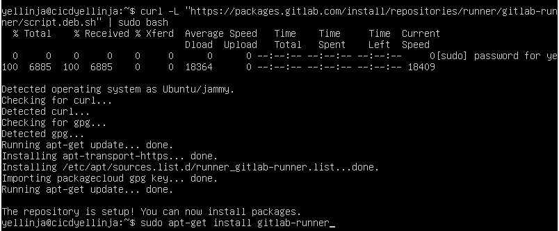 

##### Запусти **gitlab-runner** и зарегистрируй его для использования в текущем проекте (*DO6_CICD*).
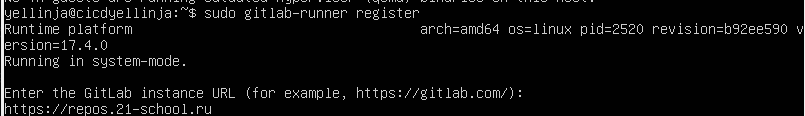 
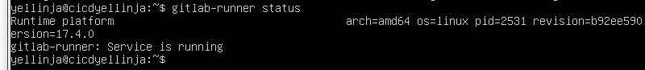 

### Part 2. Сборка

##### В файле _gitlab-ci.yml_ добавь этап запуска сборки через мейк файл из проекта _C2_.
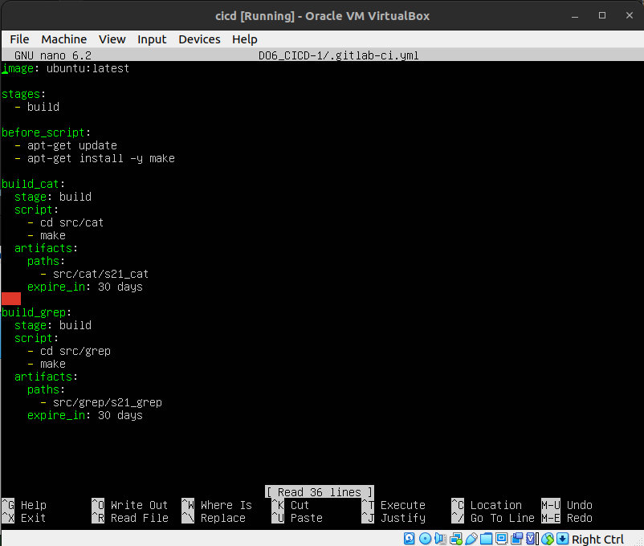 

##### Файлы, полученные после сборки (артефакты), сохрани в произвольную директорию со сроком хранения 30 дней.
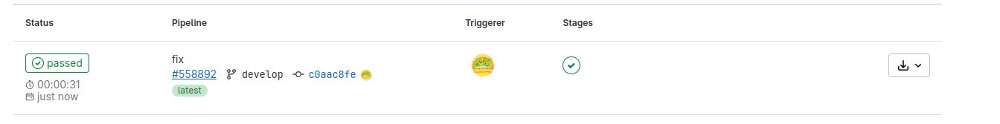 

### Part 3. Тест кодстайла

#### Напиши этап для **CI**, который запускает скрипт кодстайла (*clang-format*).
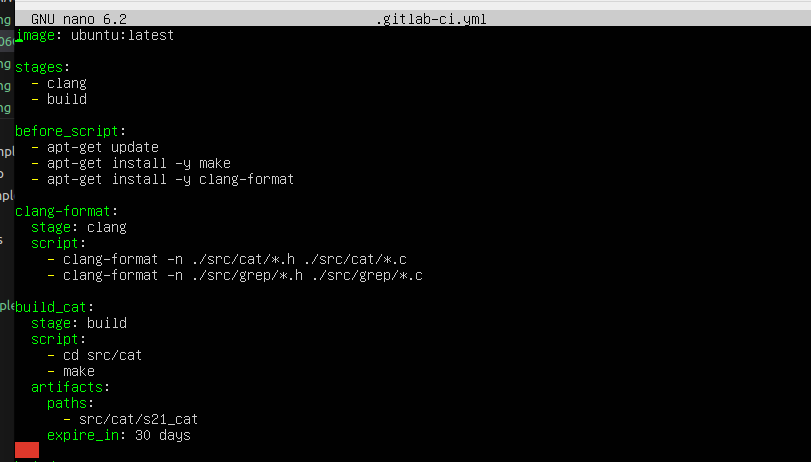
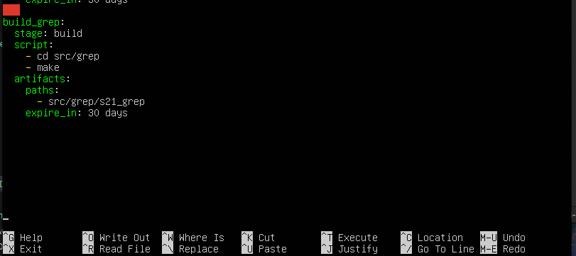 

##### В пайплайне отобрази вывод утилиты *clang-format*.
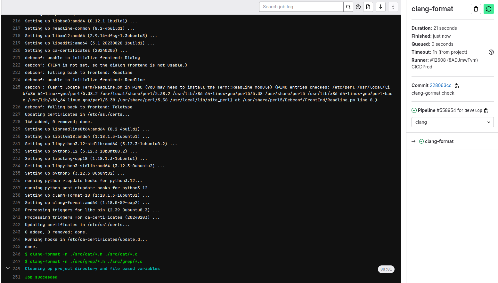 

### Part 4. Интеграционные тесты

#### Напиши этап для **CI**, который запускает твои интеграционные тесты из того же проекта.

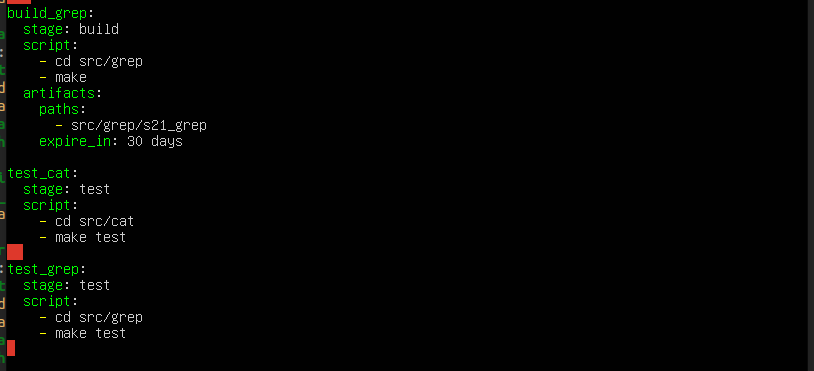

##### В пайплайне отобрази вывод, что интеграционные тесты успешно прошли / провалились.
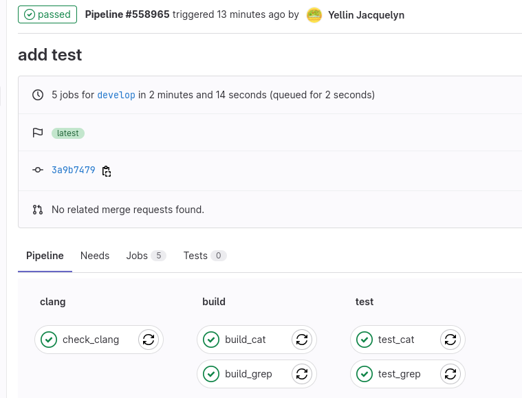

### Part 5. Этап деплоя

##### Подними вторую виртуальную машину *Ubuntu Server 22.04 LTS*.
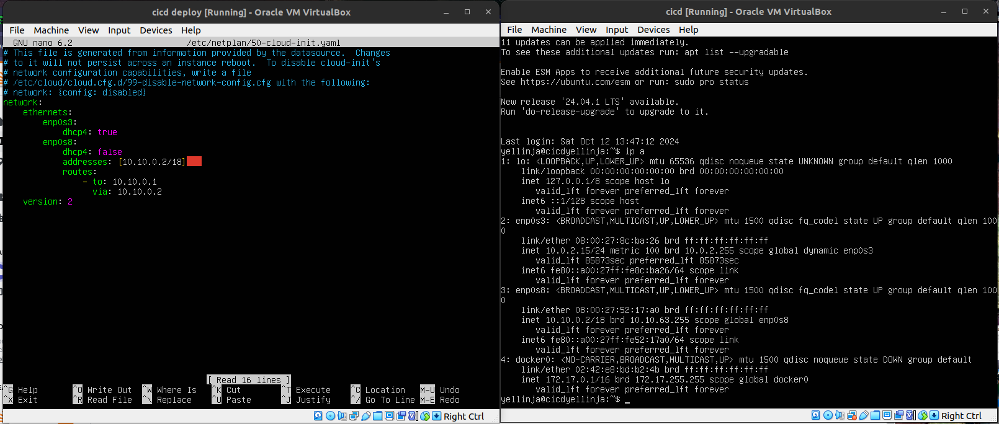

#### Напиши этап для **CD**, который «разворачивает» проект на другой виртуальной машине. В файле _gitlab-ci.yml_ добавь этап запуска написанного скрипта.

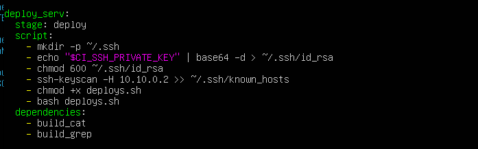

##### Напиши bash-скрипт, который при помощи **ssh** и **scp** копирует файлы, полученные после сборки (артефакты), в директорию */usr/local/bin* второй виртуальной машины.
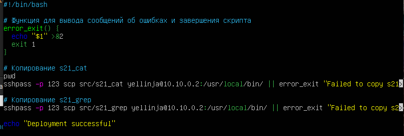

##### Результат.
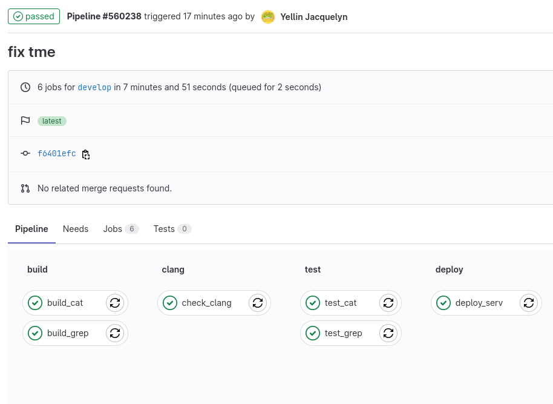

### Part 6. Дополнительно. Уведомления

##### Настрой уведомления об успешном/неуспешном выполнении пайплайна через бота  в *Telegram*.

##### sh скрипт отправки в Телеграм.
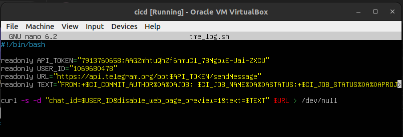

##### Настройка .gitlab-ci.yml.
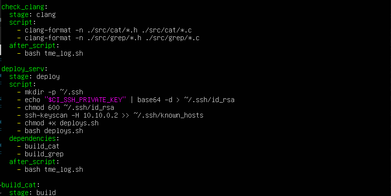

##### Вывод сообщений в телеграмме
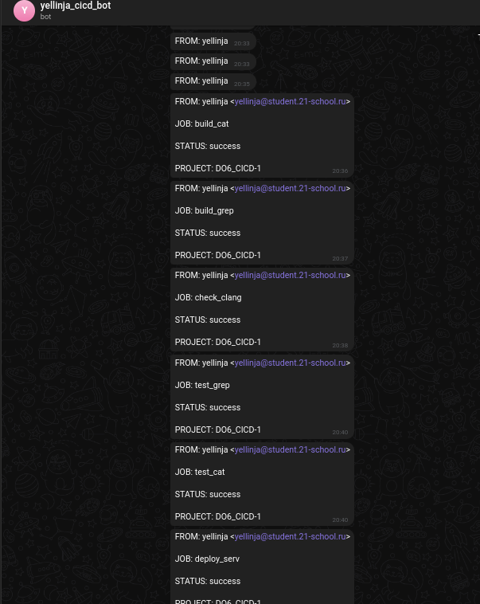